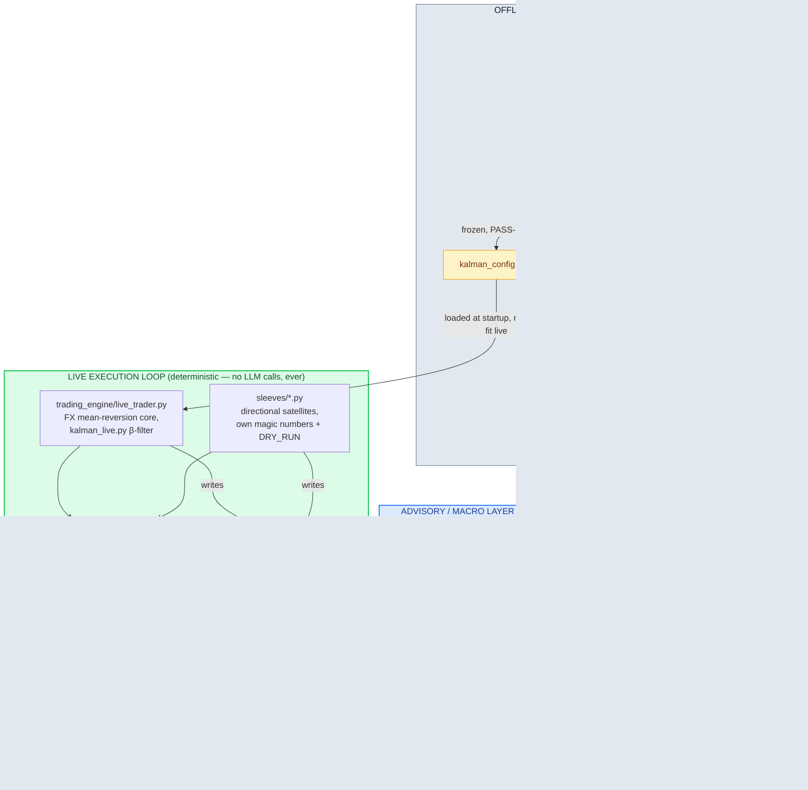

# Architecture

Two loops that never call into each other: a deterministic execution loop,
and a Claude-narrated advisory loop that only ever reads the execution loop's
output.

**Auxiliary Processes:**
- `trading_engine/ops/*.py` — out-of-band watchdogs (`pinger.py`, `leaderboard_pinger.py`) that diff `state.json` / poll the leaderboard API and alert via Telegram. They run alongside the loop, never inside it, and never write back to it.
- `research/*.py` — backtests and exploratory screeners (crypto, Donchian, metals via yfinance). Not imported by the live loop; informs parameter choices upstream of the offline calibration step.

## Why the split matters

The execution loop has a hard latency and correctness budget: a wrong call
here risks a forced liquidation, which is instant elimination under the
competition's scoring rules. It is kept fully deterministic — pure Python,
pre-fit statistical models, no network calls to an LLM in the hot path.

Claude sits one layer up, with read-only access to the *output* of that loop
(`state.json`) and to external market context (crypto/FX/metals feeds, news).
Its job is explanation and macro-context synthesis for a human operator
running the system in copilot mode — not decision-making. This is enforced
structurally, not just by convention: `claude_analyst.py` and `app.py` have no
import path back into `live_trader.py` or `mt5_executor.py`, and neither
writes to any file the execution loop reads.
