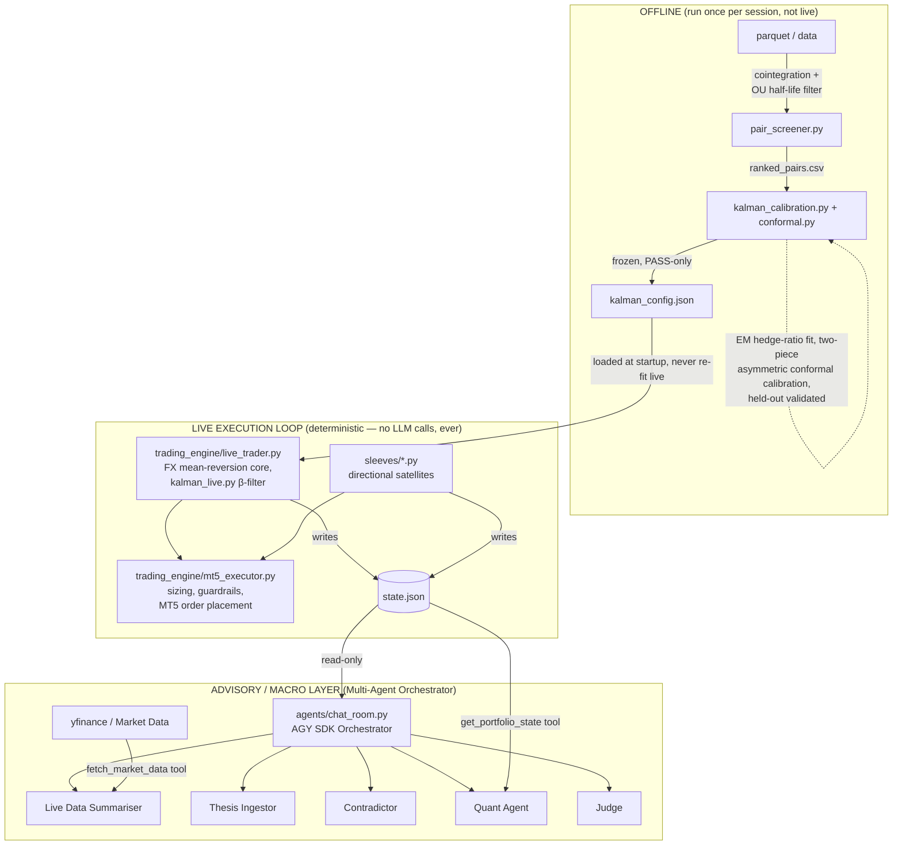

# Asymmetric Conformal Prediction in Stat-Arb & Multi-Agent Orchestration

A market-neutral pairs-trading engine based on research into **asymmetric conformal prediction**, paired with a powerful **Multi-Agent Orchestrator** for macro risk analysis and trade evaluation.

## Project Description — why it's AI-native and innovative

Most AI trading systems fail the same way: they put a slow, non-deterministic LLM directly in the execution path, where one bad call triggers a fatal drawdown. This system air-gaps the two — deterministic execution, AI reasoning — with a human on the boundary.

**Statistical core (deterministic, zero LLM).** Pairs-trading mean reversion that never calls a language model. It drops the field-standard symmetric Z-score for a custom **Asymmetric Conformal Predictor** — separate calibrated bands per side of the spread, validated out-of-sample, with any failing pair gated out before it trades. An EM-calibrated **Kalman filter** sets the hedge ratio dynamically, so risk is priced off the data, not a textbook threshold — and the band doubles as drawdown control.

**Multi-agent orchestrator (AI-native, advisory-only).** A multi-model debate (Claude Agent SDK + Gemini) where five subagents pressure-test every idea: a **Summariser** pulls live prices, an **Ingestor** builds the case, a **Contradictor** attacks it, a **Quant** reads the live book for exact sizing, and a **Judge** issues a Go/No-Go.

**The key idea: the agents recommend, but cannot trade.** There is no automated write-path from the AI layer to execution — a human is the only route to the order book. That's what makes it AI-native without being AI-fragile: the reasoning layer can be as aggressive as it likes, because a deterministic core and a human gate stand between it and real risk. Running two model families on opposing sides is deliberate — it stops one model's blind spot from waving a bad trade through.

---

## Technology Stack Used

- **Core languages & frameworks:** Python 3.10+, FastAPI (ASGI signal server), Streamlit (macro dashboard), Pydantic (typed schema validation across the signal API and agent I/O).
- **AI / agents:** Claude Agent SDK (managed agents) + Google Antigravity (AGY) SDK for multi-agent orchestration, running Claude Sonnet 4 + Gemini in multi-model debate; Nemotron 120B via Doubleword (signal narratives); Claude Workbench (agent prompt design & evaluation).
- **Statistical & quant modelling:**
  - Custom Asymmetric Conformal Predictor (two-piece split-conformal modal regression)
  - `pykalman` — EM-calibrated state-space model for dynamic hedge ratios
  - `statsmodels` — order-robust Engle-Granger cointegration (both orderings, worse p-value)
- **Data, execution & tooling:** `yfinance`, `pandas`, MetaTrader 5 (MT5) execution engine, Obsidian (research vault + dated markdown advisory reports).

---

## Architecture



---

## AI & ML Components

This system uses AI/ML at **three distinct levels**, each with a clear architectural boundary:

### Statistical ML (Signal Generation & Risk Gating)

| Component | Technique | Role | File |
|-----------|-----------|------|------|
| **Conformal predictor** | Two-piece modal split-conformal prediction (Rubio & Steel) | Fits asymmetric calibrated confidence bands per spread side; held-out coverage validation gates PASS/REVIEW | [`conformal.py`](trading_engine/conformal.py) |
| **Kalman filter** | EM-calibrated online state-space model (frozen Q/R) | Dynamic hedge-ratio estimation; adapts β to non-stationary spread drift without live re-fitting | [`kalman_calibration.py`](trading_engine/kalman_calibration.py), [`kalman_live.py`](trading_engine/kalman_live.py) |
| **Cointegration screen** | Symmetric Engle-Granger (worse of both orderings) + OU half-life | Only the worst-direction p-value counts; rejects spurious pairs that pass one ordering but fail the other | [`pair_screener.py`](trading_engine/pair_screener.py), [`live_trader.py`](trading_engine/live_trader.py) |

### LLM Integration (Advisory Layer — Zero Execution Authority)

| Component | Model / SDK | Role | File |
|-----------|-------------|------|------|
| **Multi-Agent Orchestrator** | Gemini via AGY SDK | Orchestrates the subagent debate workflow and enforces constraints | [`chat_room.py`](agents/chat_room.py) |
| **Data Summariser Subagent** | AGY Subagent | Pulls live `yfinance` data to anchor the debate in current market realities | [`chat_room.py`](agents/chat_room.py) |
| **Quant Subagent** | AGY Subagent | Reads `state.json` to calculate live position sizes and margin limits | [`chat_room.py`](agents/chat_room.py) |
| **Signal Narrative API** | Nemotron 120B (via Doubleword) | Generates 2-sentence trade rationales from pre-computed signal parameters | [`signal_server.py`](trading_engine/signal_server.py) |

---

## Key System Design Decisions

| Decision | Rationale |
|----------|-----------|
| **Two-loop separation** (execution vs. advisory) | Execution has a hard latency and correctness budget; an LLM in the hot path adds latency and non-determinism. The LLM sits one layer up with read-only access. |
| **Conformal prediction, not fixed Z-thresholds** | Real spreads are asymmetric. A fixed Z=2 entry band ignores skew, regime shifts, and asymmetric carry. The conformal predictor fits separate calibrated bands per side, validated OOS. |
| **Offline calibration → frozen config** | Pair screening, Kalman EM, and conformal fitting run once per session, not live. The live loop loads validated output and never re-fits. This eliminates lookahead bias and keeps the execution path deterministic. |
| **Atomic state writes** | `os.fsync()` + `os.replace()` prevents state corruption if the process crashes between order placement and persistence. A half-written `state.json` could orphan live positions. |

---

## Setup & Testing

```bash
# Install dependencies
pip install -r requirements.txt
cp .env.example .env   # fill in real keys (GEMINI_API_KEY required for agents)

# Run the test suite (covers conformal coverage guarantees and Kalman equivalence)
pytest tests/ -v --tb=short
```

## Running the System

```bash
# Core FX stat-arb loop (requires MT5 connection)
python trading_engine/live_trader.py

# Multi-Agent Orchestrator Chat Room (requires GEMINI_API_KEY)
python agents/chat_room.py
```
