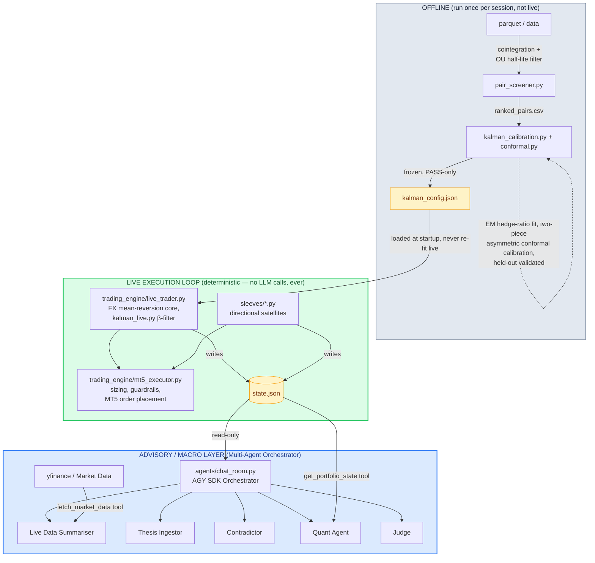

# Asymmetric Conformal Prediction in Stat-Arb & Multi-Agent Orchestration

A market-neutral pairs-trading engine based on research into **asymmetric conformal prediction**, paired with a powerful **Multi-Agent Orchestrator** for macro risk analysis and trade evaluation.

## Overview

Most pairs-trading systems size entries off a single static Z-score (e.g., enter at |Z| > 2, exit at |Z| < 0.5), assuming the spread behaves symmetrically. However, real cointegrated spreads are **not symmetric** — a spread that reverts cleanly when it's wide to the upside can behave completely differently to the downside due to regime shifts, skewed liquidity, and asymmetric carry. 

This project explores a more robust approach:
1. **Statistical Execution Core:** Trades the statistical relationship between correlated instruments (e.g. GBPUSD/USDJPY) using a two-piece modal split-conformal predictor to fit separate, calibrated confidence bands for each side of the spread.
2. **Multi-Agent Advisory Layer:** A deterministic execution loop paired with a team of AI subagents that summarize live market data, debate trading theses, and calculate position risk.

---

## 1. Asymmetric Conformal Prediction
*(See [`trading_engine/conformal.py`](trading_engine/conformal.py))*

This repo implements **Algorithm 1 from the asymmetric conformal prediction / modal-regression literature**. It fits separate calibrated confidence bands for each side of the spread, validated out-of-sample on a held-out chronological tail before a pair is ever traded live. 

A pair that fails out-of-sample coverage is marked `REVIEW`, not `PASS` — it never reaches the live book. Combined with an EM-calibrated Kalman filter for dynamic hedge ratio estimation ([`kalman_live.py`](trading_engine/kalman_live.py)), entries are sized off a distribution the data actually supports, not an assumption borrowed from a textbook example.

## 2. Multi-Agent Orchestrator
*(See [`agents/chat_room.py`](agents/chat_room.py))*

The execution side ([`trading_engine/`](trading_engine/)) is a fully deterministic loop — it never calls a language model. Sitting beside it is an advanced **Multi-Agent Orchestrator** built using the Google Antigravity (AGY) SDK.

When evaluating a trade idea or market event, the Orchestrator delegates tasks to **5 specialized subagents**:
1. **Live Data Summariser**: Uses a custom tool (`fetch_market_data`) to pull live prices from `yfinance` and summarize the current market context.
2. **Thesis Ingestor**: Takes the trading idea and builds the strongest possible bullish/bearish case for it.
3. **Contradictor**: Actively attacks the Ingestor's thesis, looking for flaws, macro headwinds, and structural risks.
4. **Quant**: Uses a custom tool (`get_portfolio_state`) to read the live execution book (`state.json`), calculates required position sizes, and assesses margin impact.
5. **Judge**: Evaluates the arguments from the Ingestor, Contradictor, and Quant, and delivers a final Go/No-Go verdict.

**Design principle: "Narrator, not decider."** The LLM layer receives pre-computed numbers as input and produces human-readable commentary as output. It has zero write access back into the execution layer.

---

## Architecture



---

## AI & ML Components

This system uses AI/ML at **three distinct levels**, each with a clear architectural boundary:

### Statistical ML (Signal Generation & Risk Gating)

| Component | Technique | Role | File |
|-----------|-----------|------|------|
| **Conformal predictor** | Two-piece modal split-conformal prediction (Rubio & Steel) | Fits asymmetric calibrated confidence bands per spread side; held-out coverage validation gates PASS/REVIEW | [`conformal.py`](trading_engine/conformal.py) |
| **Kalman filter** | EM-calibrated online state-space model (frozen Q/R) | Dynamic hedge-ratio estimation; adapts β to non-stationary spread drift without live re-fitting | [`kalman_calibration.py`](trading_engine/kalman_calibration.py), [`kalman_live.py`](trading_engine/kalman_live.py) |
| **Cointegration screen** | Symmetric Engle-Granger (worse of both orderings) + OU half-life | Only the worst-direction p-value counts; rejects spurious pairs that pass one ordering but fail the other | [`pair_screener.py`](trading_engine/pair_screener.py), [`live_trader.py`](trading_engine/live_trader.py) |

### LLM Integration (Advisory Layer — Zero Execution Authority)

| Component | Model / SDK | Role | File |
|-----------|-------------|------|------|
| **Multi-Agent Orchestrator** | Gemini via AGY SDK | Orchestrates the subagent debate workflow and enforces constraints | [`chat_room.py`](agents/chat_room.py) |
| **Data Summariser Subagent** | AGY Subagent | Pulls live `yfinance` data to anchor the debate in current market realities | [`chat_room.py`](agents/chat_room.py) |
| **Quant Subagent** | AGY Subagent | Reads `state.json` to calculate live position sizes and margin limits | [`chat_room.py`](agents/chat_room.py) |
| **Signal Narrative API** | Nemotron 120B (via Doubleword) | Generates 2-sentence trade rationales from pre-computed signal parameters | [`signal_server.py`](trading_engine/signal_server.py) |

---

## Key System Design Decisions

| Decision | Rationale |
|----------|-----------|
| **Two-loop separation** (execution vs. advisory) | Execution has a hard latency and correctness budget; an LLM in the hot path adds latency and non-determinism. The LLM sits one layer up with read-only access. |
| **Conformal prediction, not fixed Z-thresholds** | Real spreads are asymmetric. A fixed Z=2 entry band ignores skew, regime shifts, and asymmetric carry. The conformal predictor fits separate calibrated bands per side, validated OOS. |
| **Offline calibration → frozen config** | Pair screening, Kalman EM, and conformal fitting run once per session, not live. The live loop loads validated output and never re-fits. This eliminates lookahead bias and keeps the execution path deterministic. |
| **Atomic state writes** | `os.fsync()` + `os.replace()` prevents state corruption if the process crashes between order placement and persistence. A half-written `state.json` could orphan live positions. |

---

## Setup & Testing

```bash
# Install dependencies
pip install -r requirements.txt
cp .env.example .env   # fill in real keys (GEMINI_API_KEY required for agents)

# Run the test suite (covers conformal coverage guarantees and Kalman equivalence)
pytest tests/ -v --tb=short
```

## Running the System

```bash
# Core FX stat-arb loop (requires MT5 connection)
python trading_engine/live_trader.py

# Multi-Agent Orchestrator Chat Room (requires GEMINI_API_KEY)
python agents/chat_room.py
```
